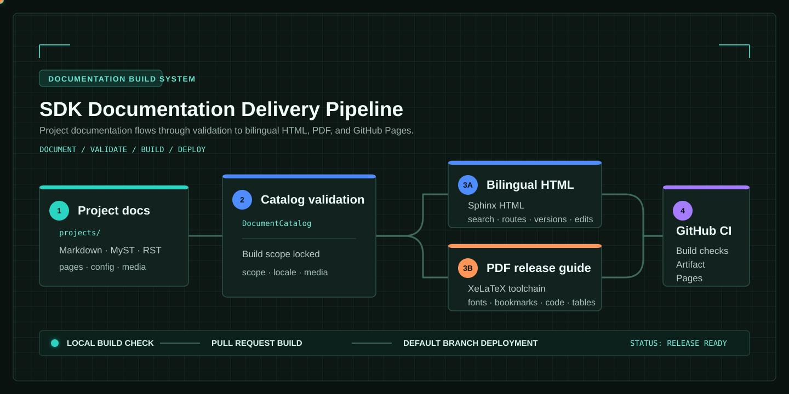

# SDK Documentation Build Template

Turning structured content into a published documentation site should not depend on manual assembly. This template keeps author-owned content in the projects directory, then validates discovery, navigation, bilingual routing, PDF typesetting, versioned builds, and GitHub Pages deployment as one delivery pipeline.

:::{admonition} This site is a runnable example
:class: tip
The sidebar, Chinese and English pages, search indexes, dark mode, version menu, edit link, and PDF download button are generated by this repository. Its commands, configuration, and output paths are intended to be reused in real SDK and product documentation.
:::

## Is it a fit?

| Content shape | Recommended capability | Result |
| --- | --- | --- |
| Tutorials, manuals, knowledge bases | Recursive document tree | Preserved hierarchy and generated chapter navigation |
| SDKs, BSPs, sample-project collections | Strict project catalog | Only declared entry documents and assets are included |
| Chinese and English product docs | Bilingual build | Isolated pages, search indexes, and counterpart routing |
| Archivable deliverables | XeLaTeX PDF | Cover, contents, bookmarks, font validation, code, and tables |
| Several maintained branches | Versioned publishing | Isolated Git worktrees, version menu, and Pages entry points |

## Recommended route

1. Follow [Quick Start](getting_started/README.md) and create a local HTML preview.
2. Select a source model in [Content Models](content_models/README.md) before moving real documentation.
3. Verify web and PDF outputs in [Build and Outputs](build_outputs/README.md).
4. Put the same rules into GitHub Actions and GitHub Pages through [Versions and Deployment](versions_deployment/README.md).

HTML, PDF, and validation share the same DocumentCatalog. A missing image, an escaping path, an unmatched project rule, or a missing PDF font fails explicitly instead of becoming a broken release. For a result-first tour, open [Showcases](showcases/README.md).
