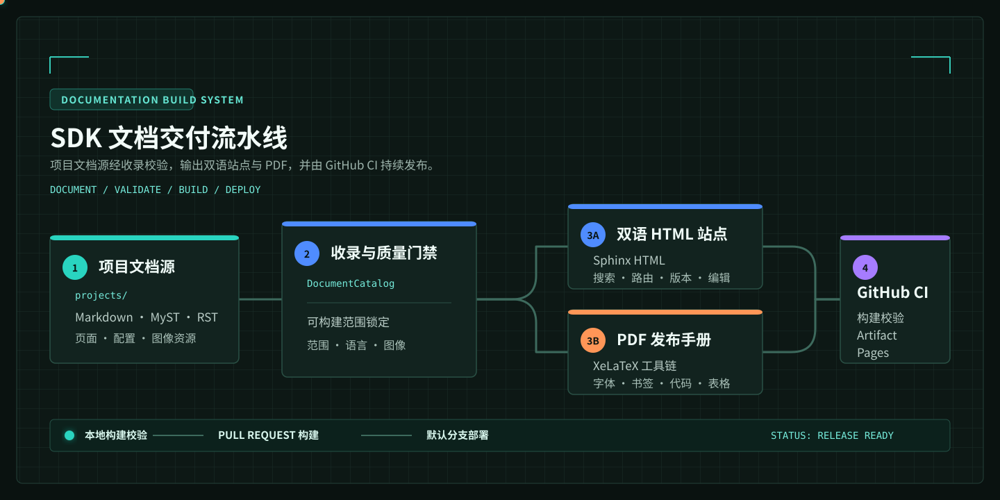

# SDK 文档构建模板

从结构化内容到可发布文档站，不应依赖手工拼接。这个模板把作者真正维护的内容放在 projects 目录，将收录、导航、双语路由、PDF 排版、多版本构建和 GitHub Pages 发布纳入同一条可验证流水线。

:::{admonition} 当前站点就是一份可运行的样例
:class: tip
左侧导航、中文和 English 页面、搜索索引、深色模式、版本菜单、编辑入口与 PDF 下载按钮，均来自本仓库的构建结果。页面中的命令、配置与产物路径可以直接作为接入真实 SDK 或产品手册时的起点。
:::

## 用 30 秒判断它是否适合你的仓库

| 你的内容形态 | 推荐能力 | 你会得到什么 |
| --- | --- | --- |
| 教程、开发手册、知识库 | 递归文档树 | 保持原始目录层级，自动建立章节导航 |
| SDK、BSP、示例工程集合 | 严格项目目录 | 只收录声明的项目入口和资源，避免第三方 README 混入 |
| 中英文产品文档 | 双语构建 | 独立页面、搜索索引和对应页语言跳转 |
| 需要可归档的交付物 | XeLaTeX PDF | 封面、目录、书签、字体校验、代码和表格排版 |
| 维护多个发布分支 | 多版本发布 | Git worktree 隔离构建、版本菜单和 Pages 入口 |

## 建议阅读路线

1. 从 [快速开始](getting_started/README_zh.md) 在本机完成一次无 PDF 的预览构建。
2. 在 [内容组织](content_models/README_zh.md) 选择适合仓库的内容模型，再开始迁移真实文档。
3. 使用 [构建与输出](build_outputs/README_zh.md) 验证 Web 页面和严格 PDF。
4. 通过 [版本与部署](versions_deployment/README_zh.md) 将同一套构建规则放入 GitHub Actions 和 GitHub Pages。

## 交付不是一次命令，而是一份契约

作者写入的内容、HTML 和 PDF 使用同一份 DocumentCatalog；这意味着网页里能看到的文档、下载 PDF 的章节和发布前被校验的资源保持一致。缺少图片、越出 projects 范围的路径、未匹配的项目规则和缺失的 PDF 字体都会显式失败，而不是在发布后留下不完整的页面。

想先看结果而不是先读理论，可直接进入 [场景化示例](showcases/README_zh.md)。
